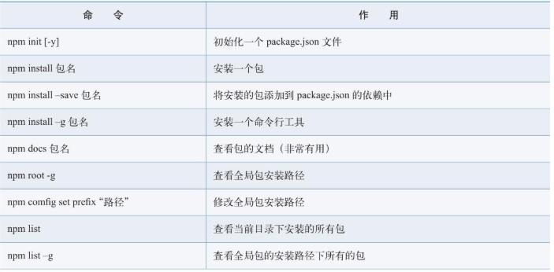
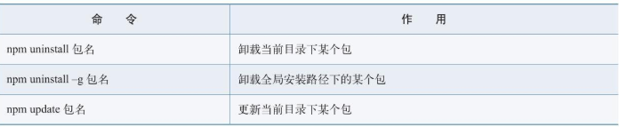

## Node.js

客户端的JavaScript主要用来处理页面的交互，使用了ECMAScript核心语法以及浏览器提供的js引擎、操作DOM等。

服务端的Javascript主要用来处理数据的交互，比如操作数据库、操作文件等

Nodejs是一个在服务端可以解析和执行JavaScript代码的运行环境，或者说是一个运行时平台。能够脱离浏览器执行js代码，底层使用的chrome V8引擎

global对象和模块作用域
- exports：模块公开的接口。是一个指向module.exports的引用。只能返回要给object，不能返回其他数据类型
- module.exports: 用于模块向外开放属性/函数。初始值为一个空对象{}。可以单独定义使用
- require：用于从外部获取一个模块的接口，也就是模块的exports接口。要使用其他模块就得先用require加载这个模块

全局可用变量/函数/对象
- _dirname和_filename变量 表示当前文件的目录和绝对路径名
- 全局函数
- console对象

### 3异步编程和包资源管理
#### 3.1 异步编程
JavaScript的执行环境是单线程的。

异步编程： 使用setTimeout()方法

回调函数的设计一般有3个约定：
- 函数名称一般为callback
- 代码中出现的错误作为callback回调函数的第一个参数进行传递
- 把真正返回的结构作为callback回调函数的第二个参数进行传递

> 还需要理解异步编程中的“事件驱动”思路

#### 3.2 包和NPM
nodejs的包遵循CommonJS规范，规范的包目录结构如下：

包结构 | 作用
--- | ---
package.json | 在顶层目录的包描述文件，说明文件
bin | 存放可执行的二进制文件
lib | 存放JavaScript文件的目录
doc | 存放文档
test | 存放测试用例

NPM是nodejs的包管理系统

require的加载机制： [demo.js](code/chap03/lib/demo.js)

### 4. Node.js文件操作
基本操作
- 文件写入
    - 同步写入（用得少）： fs.writeFileSync(file, data[, options]);
    - 异步写入（性能较高）： fs.writeFile(file, data[, options], callback);
> options 为一个对象 {encoding, mode, flag} 默认值分别为'utf8'、'0o666'、'w'
- 追加写入： appendFile
- 读取文件： readFile(file[, options], callback)
- 获取文件信息： fs.stat(path)

路径字符串操作（Path模式）
- path.basename()文件名 path.dirname()文件所在目录 path.extname()后缀
- path.join() 
- fs.mkdir() 
- fs.readdir(path, function(err, files){...})
- fs.unlink() 用于删除文件
- fs.rmdir() 用于删除空目录